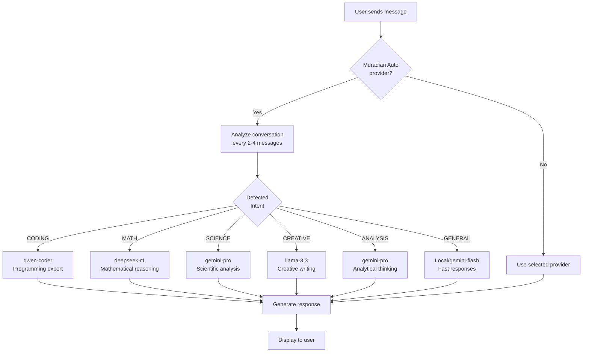

# MOSP Chat

A beautiful, multi-provider AI chat application built with Tauri, React, and TypeScript.


## Features

- 🤖 **Multi-Provider Support**: Connect to Ollama (local), OpenRouter, OpenAI, Anthropic, or Google Gemini
- 🧠 **Muradian Auto**: Intelligent AI routing that automatically selects the best model based on your question
- 💬 **Split View**: Chat with two AI models side-by-side
- 🎨 **Dark/Light Mode**: Automatic theme switching based on system preferences
- ⚡ **Fast & Lightweight**: Native desktop app powered by Tauri (~10MB)
- 🔒 **Privacy First**: All local Ollama chats stay on your machine
- 📝 **Markdown Support**: Beautiful rendering of code blocks, lists, and formatting
- 🔄 **Auto Model Download**: Automatically download Ollama models with one click

## Muradian Auto: Intelligent AI Routing

Muradian Auto is our smart provider that automatically detects the type of question you're asking and routes it to the most appropriate AI model. No more switching models manually!

### How It Works



### Intent Categories

| Category        | Triggers                           | AI Model               | Best For                                       |
| --------------- | ---------------------------------- | ---------------------- | ---------------------------------------------- |
| 🖥️ **CODING**   | Programming, algorithms, debugging | `qwen-2.5-coder-32b`   | Writing code, fixing bugs, API usage           |
| 🔢 **MATH**     | Equations, calculations, proofs    | `deepseek-r1`          | Mathematical reasoning, step-by-step solutions |
| 🔬 **SCIENCE**  | Physics, chemistry, biology        | `gemini-2.0-pro`       | Scientific explanations, research questions    |
| ✍️ **CREATIVE** | Writing, storytelling, poetry      | `llama-3.3-70b`        | Creative content, narratives, art              |
| 📊 **ANALYSIS** | Research, comparisons, evaluation  | `gemini-2.0-pro`       | Critical thinking, data analysis               |
| 💬 **GENERAL**  | Casual chat, everyday questions    | Local + `gemini-flash` | Quick responses, general conversation          |

### Example Usage

Simply select "Muradian Auto" as your provider and ask any question:

- ❓ "How do I implement a binary search in Python?" → **CODING mode**
- ❓ "What's the derivative of x³?" → **MATH mode**
- ❓ "Explain photosynthesis" → **SCIENCE mode**
- ❓ "Write a short story about space" → **CREATIVE mode**
- ❓ "Compare React vs Vue" → **ANALYSIS mode**
- ❓ "Hi, how are you?" → **GENERAL mode**

The system analyzes your conversation every 2-4 messages and automatically switches to the optimal model!

## Installation

### macOS

1. Download the latest `.dmg` from [Releases](https://github.com/Mosp-TM/MOSP-Chat/releases)
2. Open the DMG and drag MOSP Chat to Applications
3. **First Launch (Important)**: Since this app isn't notarized, you need to bypass Gatekeeper:

   **Option 1: Right-click method**
   - Right-click (or Control-click) on MOSP Chat.app
   - Click "Open" from the menu
   - Click "Open" in the dialog that appears

   **Option 2: Terminal command**

   ```bash
   xattr -cr /Applications/MOSP\ Chat.app
   ```

   To bypass the security warning for the installer (DMG):

   ```bash
   sudo xattr -cr 'MOSP Chat_0.1.0_aarch64.dmg'
   ```

   Then open the app normally.

   **Option 3: System Settings**
   - Try to open the app (it will be blocked)
   - Go to System Settings → Privacy & Security
   - Scroll down and click "Open Anyway" next to MOSP Chat

### Building from Source

#### Prerequisites

- [Node.js](https://nodejs.org/) 18+
- [Bun](https://bun.sh/) (recommended) or npm
- [Rust](https://rustup.rs/)
- [Tauri CLI](https://tauri.app/v1/guides/getting-started/prerequisites)

#### Steps

```bash
# Clone the repository
git clone https://github.com/Mosp-TM/MOSP-Chat.git
cd mosp-chat

# Install dependencies
bun install

# Run in development mode
bun tauri dev

# Build for production
bun tauri build
```

## Configuration

### Ollama (Local AI)

1. Install [Ollama](https://ollama.com/download)
2. Run Ollama (it starts automatically on macOS)
3. Select Ollama in MOSP Chat - models will be detected automatically
4. If no models are installed, click "Download deepseek-r1:1.5b" to get started

### OpenRouter / Other Providers

1. Get an API key from your provider:
   - [OpenRouter](https://openrouter.ai/)
   - [OpenAI](https://platform.openai.com/)
   - [Anthropic](https://console.anthropic.com/)
   - [Google AI](https://makersuite.google.com/app/apikey)
2. Enter your API key in the provider dialog
3. Start chatting!

## Tech Stack

- **Frontend**: React 19, TypeScript, Tailwind CSS
- **UI Components**: Radix UI, shadcn/ui
- **State Management**: Zustand
- **Desktop**: Tauri 2.0 (Rust)
- **Build Tool**: Vite

## Project Structure

```
mosp-chat/
├── src/                    # React frontend
│   ├── components/         # UI components
│   ├── lib/               # API clients (Ollama, OpenRouter, etc.)
│   └── store/             # Zustand state management
├── src-tauri/             # Tauri/Rust backend
│   ├── src/               # Rust source code
│   └── icons/             # App icons
├── public/                # Static assets
└── dist/                  # Production build output
```

## Contributing

Contributions are welcome! Please feel free to submit a Pull Request.

1. Fork the repository
2. Create your feature branch (`git checkout -b feature/amazing-feature`)
3. Commit your changes (`git commit -m 'Add some amazing feature'`)
4. Push to the branch (`git push origin feature/amazing-feature`)
5. Open a Pull Request

## License

This project is open source and available under the [MIT License](LICENSE).

## Acknowledgments

- [Tauri](https://tauri.app/) - For the amazing desktop framework
- [Ollama](https://ollama.com/) - For local AI inference
- [shadcn/ui](https://ui.shadcn.com/) - For beautiful UI components
